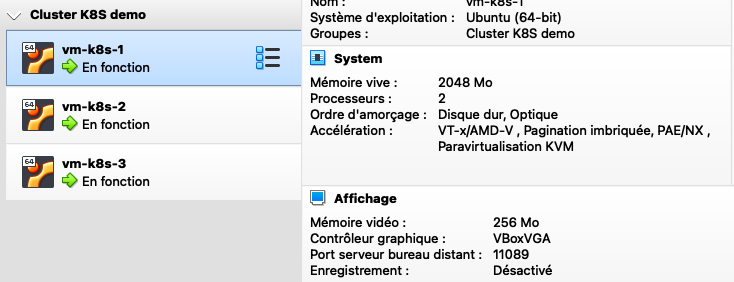

# vagrant-k8s-cluster
A sample Kubernetes cluster with Vagrant and Ansible

## Prerequisites

* [Virtualbox 6+](https://www.virtualbox.org/wiki/Downloads)

* [Vagrant 2.2.14+](https://www.vagrantup.com/downloads.html)
* Ansible 2.12.2+

## Step 1: Clone the repository

```
git clone https://github.com/nntran/vagrant-k8s-cluster.git
```

## Step 2: Set up your cluster configuration

Open the inventory file (`cluster.yml`) and adapt the configuration according to your private network and the number of worker.

By default, the cluster consists of 3 VMs (1 master and 2 worker).


```yaml
all:
  vars:
    ansible_connection: ssh
    ansible_user: vagrant
    ansible_ssh_pass: vagrant
    ansible_become: true
    ansible_become_user: root
    ansible_python_interpreter: /usr/bin/python3
  hosts:
    vm-k8s-1:
      ansible_host: 10.11.13.51
    vm-k8s-2:
      ansible_host: 10.11.13.52
    vm-k8s-3:
      ansible_host: 10.11.13.53
  children:
    master:
      hosts:
        vm-k8s-1:
      vars:
        node: "master"
    worker:
      hosts:
        vm-k8s-2:
        vm-k8s-3:
      vars:
        node: "worker"
```

## Step 3: Create the virtual machines (VM) with [Vagrant](https://www.vagrantup.com/)

```
vagrant up
```

Example of logs:
```
==> Cluster config: 
{"all"=>{"vars"=>{"ansible_connection"=>"ssh", "ansible_user"=>"vagrant", "ansible_ssh_pass"=>"vagrant", "ansible_become"=>true, "ansible_become_user"=>"root", "ansible_python_interpreter"=>"/usr/bin/python3"}, "hosts"=>{"vm-k8s-1"=>{"ansible_host"=>"10.11.13.51"}, "vm-k8s-2"=>{"ansible_host"=>"10.11.13.52"}, "vm-k8s-3"=>{"ansible_host"=>"10.11.13.53"}}, "children"=>{"master"=>{"hosts"=>{"vm-k8s-1"=>nil}, "vars"=>{"node"=>"master"}}, "worker"=>{"hosts"=>{"vm-k8s-2"=>nil, "vm-k8s-3"=>nil}, "vars"=>{"node"=>"worker"}}}}}
==> user/password: vagrant/vagrant
==> hosts: 
{"vm-k8s-1"=>{"ansible_host"=>"10.11.13.51"}, "vm-k8s-2"=>{"ansible_host"=>"10.11.13.52"}, "vm-k8s-3"=>{"ansible_host"=>"10.11.13.53"}}
==> host: ["vm-k8s-1", {"ansible_host"=>"10.11.13.51"}]
==> vm_name: vm-k8s-1
==> vm_ip: 10.11.13.51
==> host: ["vm-k8s-2", {"ansible_host"=>"10.11.13.52"}]
==> vm_name: vm-k8s-2
==> vm_ip: 10.11.13.52
==> host: ["vm-k8s-3", {"ansible_host"=>"10.11.13.53"}]
==> vm_name: vm-k8s-3
==> vm_ip: 10.11.13.53
Bringing machine 'vm-k8s-1' up with 'virtualbox' provider...
Bringing machine 'vm-k8s-2' up with 'virtualbox' provider...
Bringing machine 'vm-k8s-3' up with 'virtualbox' provider...
==> vm-k8s-1: Importing base box 'generic/ubuntu2004'...
Progress: 20%
...
```

By default, each VM is created with the following characteristics:
* **vcpu**: 2
* **ram**: 2 GB

You can change it in the `Vagrantfile`:

```ruby
# -*- mode: ruby -*-
# # vi: set ft=ruby :

# Specify minimum Vagrant version and Vagrant API version
Vagrant.require_version '>= 2.2.4'
VAGRANTFILE_API_VERSION = '2'

# Require YAML module
require 'yaml'

file_root = File.dirname(File.expand_path(__FILE__))

# Global vars
cluster_name = 'Cluster K8S demo'
provider = 'virtualbox'
vm_memory = '2048'
vm_cpus = '2'
vm_disk = 20,
box_name = 'generic/ubuntu2004'
box_version =  '3.0.28'
...
```

> Vagrant will ask you to specify the network interface if you are running on other OS than Mac OS.

After a few minutes, all the defined VM are created and operational. You will see it with Virtualbox.



## Step 4: Create the Kubernetes cluster using `Ansible`

1. Check that you have access to your VMs via SSH

```
ansible-playbook -i cluster.yml ansible/playbooks/check.yml
```

2. Update hosts and upgrade OS

```
ansible-playbook -i cluster.yml ansible/playbooks/update-host.yml
ansible-playbook -i cluster.yml ansible/playbooks/upgrade.yml
```

The last task will take a few minutes.


3. Create the Kubernetes cluster

```
ansible-playbook -i cluster.yml ansible/site.yml
```

Now you can go to take a coffee and come back later (5-10 minutes).


4. Download the Kubernetes configuration on your local host under `~/.kube` directory

```
ansible-playbook -i cluster.yml ansible/playbooks/copy-kubernetes-config.yml
```

The file is named `cluster-k8s-vagrant`.

5. Check your cluster status

```
kubectl get nodes

NAME       STATUS   ROLES                  AGE     VERSION
vm-k8s-1   Ready    control-plane,master   7m11s   v1.23.5
vm-k8s-2   Ready    <none>                 5m53s   v1.23.5
vm-k8s-3   Ready    <none>                 6m28s   v1.23.5
```

## How to remove the cluster ?

The following command will remove the kubernetes cluster and Virtualbox VMs

```
vagrant destroy -f
```
